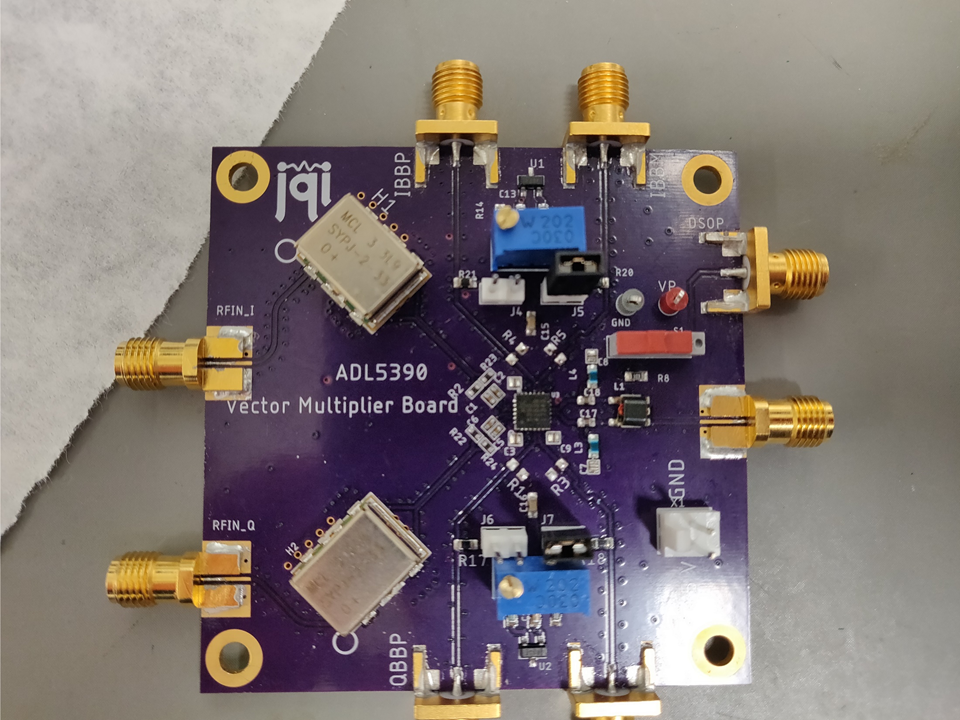

# ADL5390
This is a PCB design for an RF vector multiplier ADL5390 from Analog Devices. The functionality and design of this board is similar to the original evaluation board design. The purpose of this board is to solve the problem of crosstalk between the I-channel and the Q-channel in the original evaluation board. The main modification is the use of differential inputs on the two-channels with  a 180 hybrid coupler SYPJ-2-33+.

